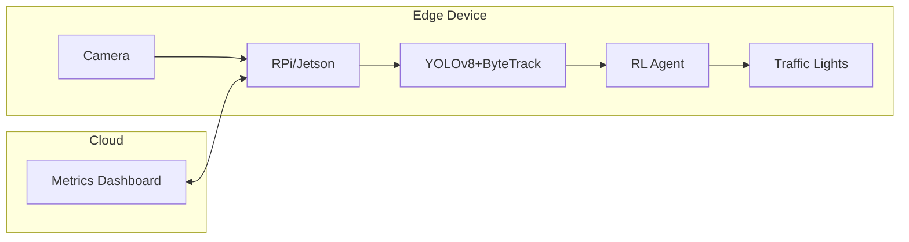

````markdown
# System Architecture: AI Traffic Light Control  

---

## 1. High-Level Overview  

```mermaid
graph TD
  A[Input: CCTV/Video] --> B[YOLOv8 Detector]
  B --> C[ByteTrack Tracker]
  C --> D[Zone Counter]
  D --> E[RL State Vector]
  E --> F[PPO/DQN Agent]
  F --> G[Traffic Light Decision]
  G --> H[Pygame Sim/Hardware]
  H --> I[Metrics Logger]
````

---

## 2. Core Modules

| **Module**                       | **Tech Stack**          | **Output**                      | **Key Parameters**                      |
| -------------------------------- | ----------------------- | ------------------------------- | --------------------------------------- |
| `detector.py`                    | YOLOv8 (ONNX-runtime)   | Bounding boxes (xyxy) + conf    | `imgsz=640`, `conf_thres=0.5`           |
| `tracker.py`                     | ByteTrack               | Stable IDs + trajectories       | `track_thresh=0.6`, `buffer_size=30`    |
| `counter.py`                     | Polygon spatial checks  | Zone-wise vehicle counts        | `cooldown=2s` per ID                    |
| `env.py`                         | RL Env (Gym-compatible) | RL state vector + reward signal | `obs = [zone_counts, time, last_phase]` |
| `agent.py`                       | PPO (SB3)               | Phase decision (action)         | Reward = `cleared - wait - starvation`  |
| `engine.py`                      | Pygame Simulation       | Visual + metric output          | Syncs to 15 FPS                         |
| `hardware/arduino_controller.py` | GPIO Control            | Signal relay to lights          | For real-world deployment               |

**Optimizations**

* 🚀 **ONNX Runtime**: 40% faster inference than PyTorch on edge devices
* 🎯 **Kalman Filter** in ByteTrack: Reduces ID flicker, better zone counting
* 🔁 **Fail-safe fallback**: If RL fails, default to max-count rule

---

## 3. Data Flow

### 🔴 Real-Time Path (Latency Budget <100ms)

```
Video Frame → YOLOv8 → ByteTrack → Zone Counter → RL Agent → Traffic Light Decision
```

### 📊 Offline Path (Training, Metrics)

```
Zone Counts → SQLite → TensorBoard → Plotly Dashboards
```

---

## 4. Deployment Topology



---

## 5. RL State Vector Composition

* **Input to Agent**:

  ```
  state = [count_N, count_S, count_E, count_W, time_elapsed, last_phase]
  ```

* **Action Space**:

  ```
  0 → NS Green  
  1 → EW Green  
  2 → All Red (clearing)  
  3 → Pedestrian Green (optional)  
  ```

* **Reward Function**:

  ```
  reward = +cleared_vehicles * 0.1  
           - avg_wait_time * 0.3  
           - starvation_penalty * 0.5  
  ```

---

## 6. Scalability & Extensions

| **Module**             | **Plug-in Point**       | **What It Adds**                       |
| ---------------------- | ----------------------- | -------------------------------------- |
| LSTM Traffic Predictor | RL input                | Forecasts 10–30s future load           |
| Anomaly Detector       | Post-tracker filter     | Flags stalled/illegal vehicles         |
| SUMO Simulator         | Replace Pygame          | Macro-level sim for full intersections |
| Multi-modal Detection  | YOLOv8 + Keypoint R-CNN | Pedestrian/bike-aware signal logic     |

---

## 7. Dependencies

```yaml
# requirements.txt (core only)
onnxruntime==1.16.0
ultralytics==8.1.0
stable-baselines3==2.1.0
pygame==2.5.0
opencv-python==4.11.0.86
numpy==2.2.5
```

---

## 8. Notes

* ✅ **Edge-compatible**: All core modules run on Raspberry Pi 5 or Jetson Nano
* ✅ **PPO-based logic** is modular, easy to retrain with SUMO, Pygame, or real-world data
* ⚠️ Future: Consider migrating from Pygame to SUMO for better junction realism

---

